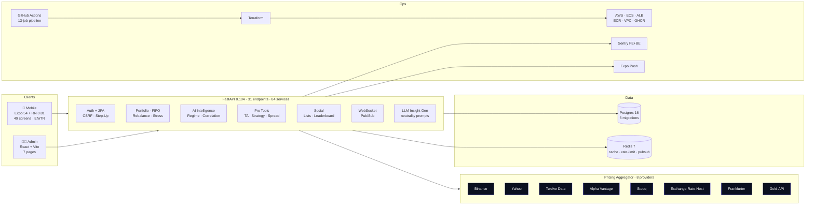
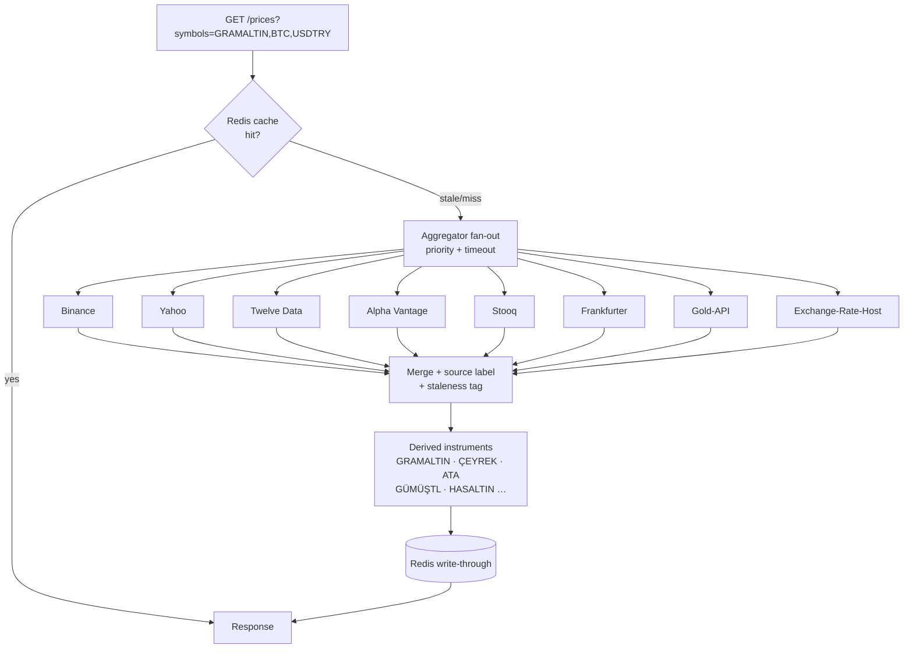
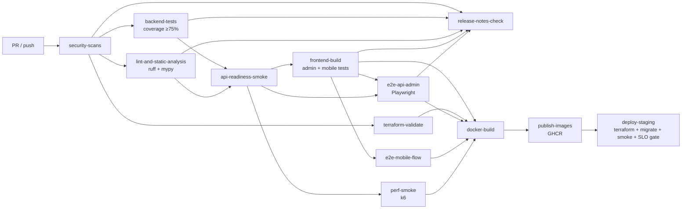

<div align="center">

# MarketPulse AI

### Cross-asset investment intelligence, engineered like a product &mdash; not a demo.

<p>
<em>Mobile-first portfolio &middot; multi-provider pricing &middot; AI insights &middot; admin operations &middot; production-grade CI/CD</em>
</p>

<p>


</p>

<p>
<a href="#-30-second-tour">tour</a> &middot;
<a href="#-the-60s-numbers">numbers</a> &middot;
<a href="#-feature-catalog">features</a> &middot;
<a href="#-architecture">architecture</a> &middot;
<a href="#-tech-stack">stack</a> &middot;
<a href="#-local-boot-in-60-seconds">run locally</a> &middot;
<a href="#-cicd-pipeline">ci/cd</a> &middot;
<a href="#-recruiter-tear-sheet">hiring</a>
</p>

</div>

---

## What this is

MarketPulse AI is a **monorepo fintech product**: a consumer-grade investor mobile app, an operator-grade admin panel, and a hardened FastAPI backend that fuses **eight real price providers** into a single, reliable cross-asset feed (FX, metals, crypto, equities, commodities). Every slice &mdash; mobile, admin, API, infra, CI &mdash; is wired together the way a funded company would actually ship it: typed contracts, Alembic migrations, 13-stage CI pipeline, observability, runbooks, and ADRs.

> If you opened this repo expecting a side project, you'll find a system.

---

## 🎬 30-second tour

<div align="center">

| Surface | What ships |
|---|---|
| 📱 **Mobile (Expo 54 + RN 0.81)** | 49 screens · EN + TR · Reanimated hero chart · biometric lock · push alerts · paper trading · social watchlists |
| 🧑‍💻 **Admin (React + Vite)** | 7 pages: dashboard, assets, users, logs, health, operations, login &mdash; with step-up for destructive actions |
| 🧠 **API (FastAPI 0.104)** | 31 endpoints · 84 service modules across 15 packages · 14 pytest files · OpenAPI client generation |
| 💹 **Pricing core** | 8 providers · aggregator · derived Turkish gold/silver · Redis cache · staleness tags · on-demand refresh |
| ☁️ **Infra** | Multi-stage Docker · docker-compose local · Terraform modules (AWS ECS/ALB/ECR/VPC) |
| 🚦 **CI/CD** | 13 GitHub Actions jobs · staged deploy · GHCR image publish · release notes gate |

</div>

> 📸 *Drop screenshots into `assets/` and they render here.*
> `assets/mobile-dashboard.png` · `assets/mobile-strategy-hub.png` · `assets/admin-operations.png` · `assets/demo.gif`

---

## ⚡ The 60s numbers

<div align="center">

| Category | Count | Verified from |
|---|---|---|
| API endpoints | **31** | `apps/api/app/api/v1/endpoints/` |
| API service modules | **84** across 15 packages | `apps/api/app/services/` |
| Price providers | **8** | `binance · yahoo · stooq · twelve-data · alpha-vantage · exchange-rate-host · frankfurter · gold-api` |
| Alembic migrations | **6** | `apps/api/alembic/versions/` |
| Backend tests | **14** | `apps/api/tests/` |
| Mobile screens | **49** (app) + **4** (auth) | `apps/mobile/src/screens/` |
| Mobile TS/TSX modules | **167** | `apps/mobile/src/**/*` |
| Zustand stores | **11** | `apps/mobile/src/store/` |
| Admin pages | **7** | `apps/admin/src/pages/` |
| i18n locales | **EN + TR** | `apps/mobile/src/i18n/locales/` |
| CI/CD jobs | **15** (13 on every PR + 2 deploy/ops gates) | `.github/workflows/ci-cd.yml` |
| Ops scripts | **9** | `infra/scripts/` |
| ADRs | **3** | `docs/adr/` |
| Lint / type gate | **0 warnings** | ruff 0.14 · ESLint 9 flat · `tsc --noEmit` |
| Backend coverage floor | **≥ 75%** | `pytest --cov-fail-under=75` |

</div>

---

## 📊 Performance & reliability numbers

> All values below are **pulled straight from the code** (`apps/api/app/core/config.py`, `apps/api/app/services/price/*`, `apps/api/app/core/rate_limit.py`, `tests/perf/k6-portfolio-benchmark.js`, `.github/workflows/ci-cd.yml`). Nothing is hand-waved.

<div align="center">

| Surface | Metric | Value | Source of truth |
|---|---|---:|---|
| Pricing cache | Redis write-through TTL | **300 s** | `PRICE_CACHE_TTL_SECONDS` |
| Pricing cache | Stale-tag threshold | **60 s** | `PRICE_STALE_THRESHOLD_SECONDS` |
| Pricing scheduler | Background poll interval | **5 s** | `PRICE_POLL_INTERVAL_SECONDS` |
| Pricing scheduler | Leader-lock TTL | **`interval × 3`** (Redis `SETNX`) | `scheduler.py` — multi-worker safe |
| Provider HTTP | Per-call timeout / retries / backoff | **8.0 s · 2 retries · 0.4 s** | `PRICE_HTTP_TIMEOUT_SECONDS`, `PRICE_PROVIDER_MAX_RETRIES`, `PRICE_PROVIDER_RETRY_BACKOFF_SECONDS` |
| Aggregator | Fallback chain depth (non-crypto) | **7 providers** | `aggregator.py` ER-Host → Frankfurter → Gold-API → Twelve Data → Alpha Vantage → Yahoo → Stooq |
| Aggregator | Fallback chain depth (crypto) | **2 providers** | Binance → Yahoo |
| Derived metals | On-demand refresh hard cap | **8 symbols / 8.0 s** per request | `ON_DEMAND_REFRESH_MAX_SYMBOLS`, `ON_DEMAND_REFRESH_TIMEOUT_SECONDS` |
| Derived metals | Derived instruments generated | **≈ 25** from 6 bases (`XAU · XAG · XPT · XPD · USDTRY · EURUSD`) | `derived_instruments.py` |
| Auth | Rate limit per action per IP | **20 req / 60 s** | `AUTH_RATE_LIMIT_*` |
| WebSocket | Connect rate limit | **30 req / 60 s** | `WS_CONNECT_RATE_LIMIT_*` |
| k6 perf gate | Latency SLO (fails CI on breach) | **p95 < 800 ms** | `tests/perf/k6-portfolio-benchmark.js` |
| k6 perf gate | Error-rate SLO | **< 2 %** | same file |
| k6 perf gate | Load profile | **10 VUs · 45 s** | same file |
| Tests | Backend coverage floor (fails CI) | **≥ 75 %** | `pytest --cov-fail-under=75` |

</div>

> These are **configured SLOs and code invariants**, not marketing numbers. p95/throughput on a real production deploy will be measured by the k6 gate and tracked through the release-gate check. That path is scripted: `tests/perf/k6-portfolio-benchmark.js` → CI job `perf-smoke` → `infra/scripts/release_gate_check.py`.

---

## 🔬 Hard problems, solved

> Quick "why this took real engineering" tour. Full write-up: **[`docs/CASE_STUDY_MARKETPULSE.md`](docs/CASE_STUDY_MARKETPULSE.md)**.

**1. Turkish gold derivatives from LBMA bases, without a direct feed.**
*Why it's hard:* GRAMALTIN, ÇEYREK, ATA, HASALTIN, GÜMÜŞ/TL… have no direct upstream — they must be synthesised from `XAU/XAG/XPT/XPD × USDTRY/EURUSD` and TRY market premia, then kept internally consistent when any single base is stale or missing. Missing XAU must produce no gold derivatives. Missing USDTRY must skip TRY-denominated pairs but still publish USD/EUR ones. Missing EURUSD must skip the EUR leg only. Zero-price bases must never propagate division errors.
*How it's solved:* `build_derived_prices()` treats each base as an optional input with explicit guards (`if usdtry and usdtry.price > 0`, `if xag and xag.price > 0`, etc.) and a ~25-instrument derivation table. When a derived symbol is requested and its bases are cold, `/prices` auto-adds `(XAU, XAG, XPT, XPD, USDTRY, EURUSD)` to the refresh batch and wraps the upstream fan-out in an 8 s `asyncio.wait_for` so one slow provider can't stall the response.

**2. 8 providers → 1 unified feed, with zero double-counting under horizontal scale.**
*Why it's hard:* 8 external providers with different auth schemes, different symbol conventions, different rate limits, some of which 429 or ban IPs. Run 3 API workers and a naïve scheduler means 3× calls, 3× the chance of being throttled. One provider timing out must not kill the whole response.
*How it's solved:* priority-aware fan-out with a 7-deep fallback chain for non-crypto and a 2-deep chain for crypto. Every provider call is isolated in its own `try/except` so a single failure demotes that provider to "missed" without poisoning the aggregate. The background scheduler uses a **Redis `SETNX` leader lock** (`locks:price_feed_scheduler`) with `interval × 3` TTL — only one worker polls upstream at any time, and leadership gracefully re-elects on crash.

**3. Cache invalidation that doesn't lie to the UI.**
*Why it's hard:* The mobile UI must never silently show stale prices, but it also must not block on the network when Redis has a recent-enough value. "Stale" and "missing" are not the same thing.
*How it's solved:* write-through to Redis with `ex=300 s`, every cached record carries `last_updated_at`, reads compute `age = now − last_updated_at` and set `is_stale = age > 60 s`. The mobile layer renders a live/stale/derived badge on every price cell using that flag. On-demand misses trigger a refresh; on-demand stales fall through to the upstream fan-out via the same refresh code path, so there is exactly one write-through site.

**4. Session hardening without ejecting the user.**
*Why it's hard:* short-lived access tokens + rotation is the right answer for fintech, but naïve rotation logs every user out on refresh or creates a "replay an old refresh token and stay logged in forever" window.
*How it's solved:* refresh tokens are **hashed at rest**, rotated on every use, and the previous family is revoked atomically. CSRF is enforced on all mutating cookie flows. Destructive admin actions require a **step-up TOTP re-auth** challenge, not just the existing session. Billing webhooks go through HMAC signature verification + a Redis body-fingerprint replay guard.

---

## 🧭 Why this repo is different

**1. It behaves like a product, not a portfolio piece.**
Login → onboarding with KVKK/GDPR consent → biometric lock → live portfolio hero → cross-asset AI insights → add transaction with step-up → push-notified alerts → shareable recap cards. Every screen has an empty state, a loading skeleton, a stale/live badge, and an error path.

**2. The backend is senior-level, not tutorial-level.**
JWT + refresh-token rotation with hashing, CSRF for cookie auth, Redis-backed rate limiting (per-path, per-IP, trusted-proxy CIDR aware), step-up auth for destructive admin actions, HMAC-verified billing webhook with replay protection on Redis, WebSocket fan-out via Redis pub/sub, audit log with actor + before/after diff.

**3. Pricing is a real system, not a mock.**
Eight providers, a unified aggregator, a derived-instrument layer that synthesises Turkish gold variants (GRAMALTIN, ÇEYREK, YARIM, TAM, ATA, GÜMÜŞ/TL…) from LBMA + FX bases, a staleness model, an on-demand refresh path that auto-pulls upstream bases when a derived symbol misses, and Redis caching.

**4. It shows up to work every day.**
13 CI jobs on every PR/push: secret scans, SAST, dep-audit, ruff, mypy, pytest with ≥75% coverage floor, admin+mobile tests, Playwright e2e, k6 perf, Terraform validate, release-notes gate, Docker build, GHCR publish, staged Terraform deploy with Alembic migrate + smoke + release-gate SLO check.

---

## ✨ Feature catalog

<details open>
<summary><strong>📱 Mobile — investor experience (49 app screens)</strong></summary>

<br>

**Home & Portfolio**
- `HomeDashboardScreen` · animated portfolio hero + cross-asset AI feed
- `PortfolioScreen`, `PortfolioSharedScreen`, `PortfolioDenominationScreen` &mdash; multi-currency (TRY / USD / EUR / BTC / gold-gram)
- `PortfolioMultiGoalsScreen` · multi-asset savings goals with tempo estimator
- `PortfolioRebalancerScreen` · target weights, drift, one-tap plan
- `PortfolioDcaSimulatorScreen` · historical DCA eğrisi, shareable card
- `PortfolioStressTestScreen` · "if 2008 hit today" scenario engine
- `PortfolioTaxLotsScreen`, `FifoSummaryScreen` · FIFO/LIFO realised P&L

**Cross-asset AI**
- `IntelligenceHubScreen` · regime detector · correlation heatmap · ratio radar · macro-calendar impact
- `InsightsScreen` · neutral, LLM-guarded insight cards (no financial advice)
- `AssetDetailScreen` · per-asset deep card (TA + fundamentals + on-chain when relevant)

**Markets & Data**
- `MarketsScreen` · crypto · FX · metals · favourites with stale/derived/live badges
- `MarketNewsScreen` · RSS-powered news with asset tagging
- `ConverterScreen` · any-to-any asset converter
- `WatchlistScreen`, `SharedWatchlistScreen`

**Pro Tools**
- `TechnicalAnalysisScreen` · RSI · MACD · Bollinger · Fibonacci with AI commentary
- `FormulaAlertsScreen` · multi-condition formula alerts (Alerts 2.0)
- `SpreadDetectorScreen` · inter-exchange arbitrage radar
- `VolatilityConeScreen` · realised vs implied volatility
- `PositionSlicingScreen` · scheduled DCA slicing calculator
- `StrategyPlaygroundScreen`, `StrategyHubScreen` · backtestable rule-based strategies
- `TaxReportScreen` · PDF + CSV export
- `PaperOrdersScreen` · paper trading with stop/limit/OCO

**Social & Growth**
- `CommunityListsScreen`, `CommunityListDetailScreen` · curated/community watchlists
- `CopyStrategyScreen` · follow another user's paper strategy
- `LeaderboardScreen` · paper-trading season leaderboards by asset class
- `LiveEventsScreen` · weekly analyst livestream slot
- `ReferralScreen` · point-based referrals
- `ShareCardStudioScreen` · export portfolio/compare/wrapped cards as PNG

**Recap & Education**
- `WeeklyRecapScreen` · AI-generated Sunday portfolio summary
- `MonthlyWrappedScreen` · Spotify-Wrapped-style personal report
- `AcademyScreen`, `AcademyArticleScreen` · short-form financial literacy cards

**Trust & Account**
- `TwoFactorScreen` · TOTP setup/verify/disable
- `TransparencyScreen` · every data source listed with freshness SLA
- `AlertsScreen`, `AlertHistoryScreen` · push-notified alerts + history
- `CompareAssetsScreen` · one-tap multi-asset comparison + share
- `ProfileScreen`, `EditProfileScreen`, `ProToolsHubScreen`, `SocialHubScreen`, `PortfolioPowersHubScreen`

**Auth flow**
- `SplashScreen → OnboardingScreen → LoginScreen/RegisterScreen` with KVKK/GDPR consent steps
- `onboardingSteps.ts` · declarative step registry

</details>

<details>
<summary><strong>🧑‍💻 Admin — operator console (7 pages)</strong></summary>

<br>

| Page | Purpose |
|---|---|
| `DashboardPage` | SLO/throughput/active-users overview |
| `AssetsPage` | asset CRUD + image + enable/disable with audit |
| `UsersPage` | user search, subscription tier, plan change with step-up |
| `LogsPage` | append-only audit log with filters, actor, before/after diff |
| `HealthPage` | liveness + readiness + provider health + rate-limit telemetry |
| `OperationsPage` | incident center, one-click ops workflows |
| `LoginPage` | admin auth with step-up challenge path |

Built with **React 18 + Vite + React Router**, tested with **Vitest + Testing Library + jsdom**, e2e-covered with Playwright.

</details>

<details>
<summary><strong>🧠 Backend — 31 endpoints · 15 service packages</strong></summary>

<br>

**Endpoint groups** (`apps/api/app/api/v1/endpoints/`):
`auth · two_factor · users · portfolio · portfolio_powers · transactions · watchlist · assets · alerts · charts · prices · market_news · insights · intelligence · deep_card · pro_tools · recap · sharing · social · stats · academy · trust · billing · notifications · audit_logs · analytics · health · admin · websocket`

**Service packages** (`apps/api/app/services/`):
- **price** · 8 providers · `aggregator` · `cache` · `derived_instruments` · `scheduler`
- **intelligence** · cross-asset regime + correlation + ratio signals
- **deep_card** · per-asset-class deep modules
- **portfolio_powers** · rebalancer · DCA · goals · stress · tax lots (FIFO)
- **pro_tools** · TA · alerts 2.0 · spread · vol cone · position slicer · tax export · playground
- **social** · community lists · leaderboard · copy strategy
- **trust** · steel-account scoring · transparency
- **llm** · insight generator with neutrality-enforcing prompts
- **alert** · evaluator loop with event emission
- **market** · RSS news ingestion
- **push** · Expo Push client
- **websocket** · manager · dispatcher · redis listener · connection pool
- **portfolio** · calculator · FIFO · access checks
- **auth_service**, **audit_service**, **jobs/queue**

**Data models**: `user · portfolio · asset · alert · audit · billing · portfolio_powers · pro_tools · social · push_device`

**Schemas (Pydantic v2)**: 19 schema files covering every API surface.

</details>

<details>
<summary><strong>💹 Pricing pipeline</strong></summary>

<br>

- **8 providers**: Binance (crypto), Yahoo + Stooq (equities), Twelve Data + Alpha Vantage (hybrid), Exchange-Rate-Host + Frankfurter (FX), Gold-API (metals).
- **Aggregator**: priority-aware fan-out, per-provider timeout, merged response with `source` label + `last_updated_at` + `isStale` tag.
- **Derived instruments**: synthesises `GRAMALTIN · HASALTIN · AYAR22 · AYAR14 · ÇEYREKYENİ/ESKİ · YARIM · TAM · ATA · ATA5 · GREMSE · GÜMÜŞTL · GÜMÜŞONS · PLATİNONS · PALADYUMONS` and more from XAU/XAG/XPT/XPD × USDTRY/EURUSD.
- **Cache**: Redis write-through with staleness windows.
- **On-demand refresh**: when a derived metal is requested and its upstream bases are cold, the `/prices` endpoint auto-adds the required bases to the refresh batch so `build_derived_prices` never receives an empty input.

</details>

---

## 🏗 Architecture

### System overview



### Pricing pipeline (fan-out + fallback + derived)



---

## 🧰 Tech stack

<div align="center">

| Layer | Stack |
|---|---|
| **Monorepo** | npm workspaces · **Turborepo** pipelines · shared `@marketpulse/ui` + `@marketpulse/types` packages |
| **Mobile** | Expo 54 · React Native 0.81 · **Reanimated 3** + **Worklets** · Zustand (11 stores) · React Navigation (bottom-tabs + native-stack) · Axios · i18next + react-i18next (EN/TR) · **lucide-react-native** icons · **@shopify/flash-list** virtualization · **react-native-svg** charts · **Sentry React Native** · **react-native-performance** (cold-start) |
| **Mobile native hooks** | `expo-haptics` · `expo-blur` · `expo-linear-gradient` · `expo-image` · `expo-clipboard` · `expo-sharing` · `expo-file-system` · `expo-notifications` · `expo-local-authentication` (biometric) · `expo-secure-store` (token vault) · `expo-localization` |
| **Admin** | React 18 · Vite · TypeScript · **React Router DOM** · Vitest + Testing Library + jsdom |
| **API** | FastAPI 0.104 · SQLAlchemy 2 · **Pydantic v2** + pydantic-settings · Alembic · httpx · `websockets` 12 · `uvicorn[standard]` · Celery-style in-process workers · Expo Push client |
| **Auth & crypto** | `python-jose[cryptography]` · `passlib[bcrypt]` · TOTP (base32 secret + HOTP dynamic truncation) · HMAC webhook verify |
| **Data** | PostgreSQL 16 · Redis 7 (cache + rate-limit + pub/sub) · `psycopg2-binary` |
| **Pricing** | 8 providers fused by a priority-aware aggregator · derived-instrument layer · Redis write-through · on-demand upstream refresh |
| **Infra** | **Multi-stage Dockerfile** (`base → dev → runtime`) · Docker Compose · **Terraform** (AWS ALB/ECS/ECR/VPC · env overlays) |
| **CI/CD** | 13-job GitHub Actions pipeline · GHCR publish · staged Terraform deploy · Alembic migrate · smoke + release-gate SLO check |
| **Quality** | ruff 0.14 · **mypy** · pytest + pytest-cov (≥75% floor) · ESLint 9 flat · **typescript-eslint** · Playwright · **k6** perf |
| **Observability** | Sentry (FE + BE) · `/health` + `/api/v1/health/readiness` probes · structured append-only audit log |
| **Security scanners** | **gitleaks** · **semgrep** SAST · **pip-audit** (`--strict`) · **npm audit** (`--audit-level=high`) |

</div>

---

## 📁 Monorepo layout

```
MarketPulseAI/
├── apps/
│   ├── mobile/              Expo + RN investor app
│   │   └── src/
│   │       ├── screens/     49 app screens + 4 auth screens
│   │       ├── components/  alert · asset · charts · dashboard · deep-card
│   │       │                · effects · intelligence · onboarding · portfolio
│   │       │                · portfolio-powers · social · transaction · trust · ui
│   │       ├── store/       11 Zustand stores
│   │       ├── i18n/        EN + TR locales
│   │       ├── ws/          authenticated WebSocket client
│   │       └── hooks/       useTransactionForm, …
│   ├── admin/               React + Vite operations console (7 pages)
│   └── api/                 FastAPI backend
│       ├── app/api/v1/endpoints/   31 endpoints
│       ├── app/services/           15 packages · 84 files
│       │    (price · intelligence · deep_card · portfolio · portfolio_powers
│       │     · pro_tools · social · trust · llm · alert · market · push
│       │     · websocket · jobs · auth_service · audit_service)
│       ├── app/models/             10 SQLAlchemy models
│       ├── app/schemas/            19 Pydantic v2 schemas
│       ├── alembic/versions/       6 schema migrations
│       ├── tests/                  14 pytest files · ≥75% coverage floor
│       ├── ruff.toml               line-length 120 · per-file-ignores
│       └── Dockerfile              multi-stage · base → dev → runtime
├── packages/
│   ├── ui/                  shared design tokens + primitives
│   ├── types/               shared TS contracts
│   └── config/              shared workspace config
├── infra/
│   ├── docker-compose.yml   postgres · redis · api · worker · admin
│   ├── scripts/             9 ops scripts (bootstrap · smoke · rollback · rotate …)
│   └── terraform/           modules + environments (staging/prod overlays)
├── tests/
│   ├── e2e/                 Playwright (admin-smoke · api-health)
│   └── perf/                k6 portfolio benchmark
├── docs/
│   ├── adr/                 3 ADRs + template + index
│   ├── security/            SECURITY_BASELINE · AUTOMATED_CHECKS_MATRIX
│   ├── releases/            release discipline (required on PRs)
│   ├── CASE_STUDY_MARKETPULSE.md · RUNBOOK.md · DEPLOYMENT_README.md
│   ├── PRODUCTION_ENVIRONMENT_GUIDE.md · TEST_STRATEGY.md
│   ├── SECURITY_CHECKLIST.md · APP_STORE_RELEASE_CHECKLIST.md
│   └── PRIORITY_ACTION_PLAN.md
├── turbo.json               Turborepo pipelines
└── .github/workflows/ci-cd.yml   13 jobs
```

---

## 🚀 Local boot in 60 seconds

### One-liner

```bash
npm run setup:local
```

Under the hood (`infra/scripts/bootstrap_local.sh`): installs deps, bootstraps `infra/.env`, brings up `postgres + redis + api + worker + admin`, runs Alembic migrations, seeds demo data, and generates OpenAPI clients for admin + mobile.

### Endpoints

| Surface | URL |
|---|---|
| Admin console | `http://localhost:5173` |
| API Swagger | `http://localhost:8000/docs` |
| Readiness probe | `http://localhost:8000/api/v1/health/readiness` |

### Demo credentials

```
admin@marketpulse.ai / Admin123!
demo@marketpulse.ai  / Demo12345!
```

### Mobile (Expo Go)

```bash
cd apps/mobile && npm run dev       # scan QR in Expo Go
```

### Developer commands

```bash
npm run dev                          # turbo parallel dev servers
npm run build                        # turbo build
npm run lint                         # repo-wide lint
npm run setup:local                  # full local stack
npm run demo:live                    # seeded live demo run
npm run seed:local                   # reseed Postgres
npm run generate:api-types           # regen OpenAPI clients
npm run test:e2e                     # Playwright
npm run test:perf:k6                 # k6 benchmark
npm run infra:validate               # terraform fmt+init+validate

# backend
cd apps/api && ruff check app && python3 -m pytest --cov=app

# mobile
cd apps/mobile && npm run lint && npm run typecheck
```

---

## 🚦 CI/CD pipeline

Every PR and every push to `main` runs [`.github/workflows/ci-cd.yml`](.github/workflows/ci-cd.yml). The DAG:



| # | Job | What it does |
|---|---|---|
| 1 | `security-scans` | gitleaks · semgrep · pip-audit (`--strict`) · npm audit (high) · baseline docs check · lockfile check |
| 2 | `backend-tests` | `pytest --cov=app --cov-report=xml --cov-fail-under=75` + coverage artifact upload |
| 3 | `lint-and-static-analysis` | npm monorepo lint · `ruff check app tests` · `mypy app --config-file mypy.ini` |
| 4 | `api-readiness-smoke` | `docker compose up postgres redis api` → waits for `/api/v1/health/readiness` |
| 5 | `frontend-build` | builds admin · runs admin Vitest suite · runs mobile Jest suite |
| 6 | `e2e-api-admin` | boots docker stack + admin preview · Playwright e2e across admin + API |
| 7 | `e2e-mobile-flow` | runs onboarding flow smoke test |
| 8 | `perf-smoke` | k6 portfolio benchmark against live API |
| 9 | `terraform-validate` | `terraform fmt -check · init · validate` |
| 10 | `release-notes-check` | enforces a new file under `docs/releases/` on every PR |
| 11 | `docker-build` | builds API + admin images tagged with commit SHA |
| 12 | `publish-images` | pushes API + admin images to **GHCR** |
| 13 | `deploy-staging` | Terraform plan/apply · Alembic migrate · `post_deploy_smoke.sh` · `release_gate_check.py` SLO verdict |

---

## 🔐 Security posture

| Control | Implementation |
|---|---|
| Session auth | Cookie auth + **CSRF** enforcement for mutating cookie flows |
| Refresh tokens | **Hashed at rest** · rotated on every refresh · revocable |
| Rate limiting | Redis-backed · per-path + per-IP · **trusted-proxy CIDR aware** |
| Admin actions | Role gating + **step-up re-auth** for destructive ops |
| 2FA | TOTP setup / verify / disable · base32 secret · HOTP dynamic truncation |
| Webhooks | **HMAC signature verify** + Redis **replay protection** on body fingerprint |
| Audit log | Append-only `audit_logs` with actor · entity · **before/after diff** |
| App-layer | Biometric lock · TOTP · "Steel Account" badge · transparency page · disclaimer gate |
| Supply chain | gitleaks · semgrep · pip-audit `--strict` · npm audit high · lockfile-only installs |

See [`docs/SECURITY_CHECKLIST.md`](docs/SECURITY_CHECKLIST.md) · [`docs/security/SECURITY_BASELINE.md`](docs/security/SECURITY_BASELINE.md) · [`docs/security/AUTOMATED_CHECKS_MATRIX.md`](docs/security/AUTOMATED_CHECKS_MATRIX.md).

---

## 🛠 Operations scripts (`infra/scripts/`)

| Script | Purpose |
|---|---|
| `bootstrap_local.sh` | full local stack setup (deps · env · compose · migrate · seed · OpenAPI) |
| `run_live_demo.sh` | seeded end-to-end demo run |
| `post_deploy_smoke.sh` | black-box smoke checks against a deployed env |
| `release_gate_check.py` | SLO + funnel verdict after staged deploy |
| `rollback_release.sh` | rollback path invoked from runbook |
| `rotate_secrets.sh` | secret rotation workflow |
| `run_incident_playbook.sh` | incident playbook entry-point |
| `security_incident_response.sh` | sev-1 security response automation |
| `validate_terraform.sh` | fmt + init + validate across environments |

---

## 📐 Engineering principles (documented, not implied)

- **ADRs for every consequential decision** → [`docs/adr/`](docs/adr/)
  - `0001` API / worker split &middot; `0002` Refresh-token rotation &middot; `0003` Realtime architecture (Redis pub/sub + WS)
- **Case study** of a shipped slice → [`docs/CASE_STUDY_MARKETPULSE.md`](docs/CASE_STUDY_MARKETPULSE.md)
- **Test strategy** → [`docs/TEST_STRATEGY.md`](docs/TEST_STRATEGY.md)
- **Runbook** with incident automation hooks → [`docs/RUNBOOK.md`](docs/RUNBOOK.md)
- **Release discipline** → [`docs/releases/README.md`](docs/releases/README.md) *(enforced by `release-notes-check` CI job)*
- **App-store release checklist** → [`docs/APP_STORE_RELEASE_CHECKLIST.md`](docs/APP_STORE_RELEASE_CHECKLIST.md)
- **Production environment guide** → [`docs/PRODUCTION_ENVIRONMENT_GUIDE.md`](docs/PRODUCTION_ENVIRONMENT_GUIDE.md)
- **Priority roadmap** → [`docs/PRIORITY_ACTION_PLAN.md`](docs/PRIORITY_ACTION_PLAN.md)

---

## 🗺 Roadmap

- [x] Cross-asset AI insights (regime detector, correlation heatmap, ratio radar, macro calendar)
- [x] Deep per-asset cards (metals / crypto / FX / equities / commodities / ETF)
- [x] Portfolio superpowers (multi-denomination, rebalancer, DCA, goals, stress, FIFO tax lots)
- [x] Pro tools (TA, Alerts 2.0, spread detector, vol cone, position slicer, tax export, strategy playground)
- [x] Social layer (community lists, leaderboard, copy strategy, referral, share cards, live events)
- [x] Recap layer (weekly recap, monthly wrapped, academy articles)
- [x] Trust layer (live source badge, transparency page, Steel Account, disclaimer)
- [x] Turkish gold/silver derived instruments with auto-base refresh
- [x] Premium hero sparkline (Catmull-Rom smoothing, gradient, glow)
- [x] Multi-stage Docker + ruff/mypy/ESLint/typecheck CI gates + 13-job CI/CD
- [ ] Apple Watch complications + iOS Live Activity + Dynamic Island
- [ ] iOS/Android home-screen widgets
- [ ] Passkeys + WebAuthn
- [ ] Household / multi-portfolio sharing
- [ ] Inter-exchange arbitrage streaming channel

---

## 👥 Recruiter tear sheet

<div align="center">

<table>
<tr><th align="left">Signal recruiters / hiring managers care about</th><th>Where it shows up in this repo</th></tr>
<tr><td>Full-stack ownership</td><td><code>apps/mobile</code> · <code>apps/admin</code> · <code>apps/api</code> · <code>packages/</code> · <code>infra/</code></td></tr>
<tr><td>Product thinking in engineering</td><td>49 mobile screens with empty/loading/error states · EN+TR i18n · haptics · tabular-nums · biometric lock · share-card studio</td></tr>
<tr><td>Fintech-grade security habits</td><td>CSRF · rotated refresh tokens · step-up · HMAC + replay-guarded webhooks · TOTP · biometric · append-only audit log</td></tr>
<tr><td>System design depth</td><td>8-provider pricing aggregator · derived-instrument layer · Redis pub/sub WS · FIFO tax lots · LLM neutrality prompts</td></tr>
<tr><td>CI / release discipline</td><td>13-job <code>ci-cd.yml</code>: gitleaks · semgrep · pip-audit · ruff+mypy · pytest ≥75% · Playwright · k6 · Terraform validate · release-notes gate · GHCR publish · staged deploy</td></tr>
<tr><td>Operational maturity</td><td>Runbook · 3 ADRs · case study · 9 ops scripts · incident playbook · rollback automation · app-store release checklist</td></tr>
<tr><td>Code-quality seriousness</td><td>ruff 0 warnings · ESLint 9 flat 0 warnings · <code>tsc --noEmit</code> clean · multi-stage Dockerfile · Turborepo pipelines</td></tr>
<tr><td>IaC + cloud</td><td>Terraform modules for ALB/ECS/ECR/VPC · staging overlay · GHCR image registry · automated Alembic migrate</td></tr>
</table>

</div>

> **If you are hiring a senior full-stack / product-minded engineer** &mdash; clone the repo, run `npm run setup:local`, and you're looking at a shipped-quality fintech system in under a minute.

---

## 🤝 Contributing

PRs are welcome. Before opening one:

1. `cd apps/api && ruff check app && python3 -m pytest -q`
2. `cd apps/mobile && npm run lint && npm run typecheck`
3. Add / update a release note under `docs/releases/` *(required by CI)*
4. If your change is architectural, propose or update an ADR under `docs/adr/`

---

## 📜 License

MIT &mdash; do whatever you want, just don't remove the attribution.

## 👋 Author

Built end-to-end by **[@ardamoustafa1](https://github.com/ardamoustafa1)** as a senior-level engineering showcase: product thinking, system design, security posture, and operational discipline &mdash; in one monorepo.

<div align="center">

**If this repo helped you or impressed you, please [⭐ star it](https://github.com/ardamoustafa1/MarketPulseAI) &mdash; that's the fuel that keeps it open-source.**

</div>
