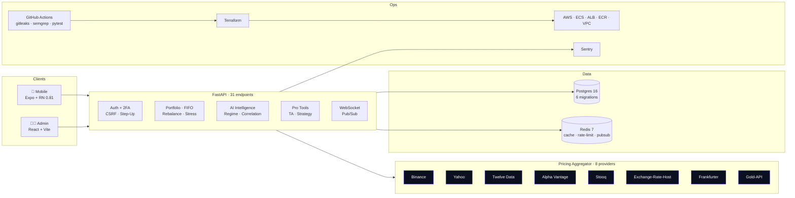
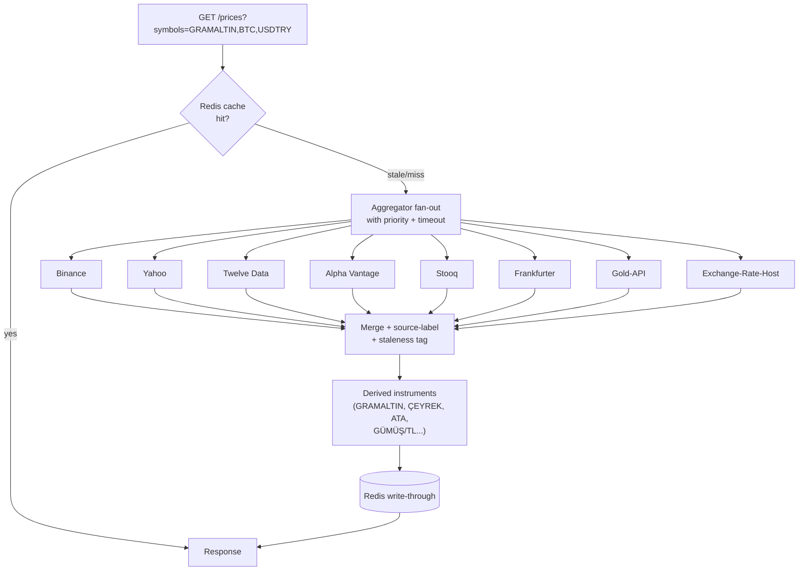
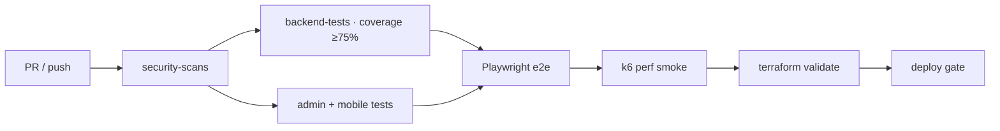

<div align="center">

# MarketPulse AI

### Cross-asset investment intelligence, engineered like a product &mdash; not a demo.

<p>
<em>Mobile-first portfolio &middot; multi-provider pricing &middot; AI insights &middot; admin operations &middot; production-grade CI</em>
</p>

<p>


</p>

<p>
<a href="#-30-second-tour">30-sec tour</a> &middot;
<a href="#-the-60-numbers">the 60s numbers</a> &middot;
<a href="#-architecture">architecture</a> &middot;
<a href="#-local-boot-in-60-seconds">run locally</a> &middot;
<a href="#-quality--safety-gates">quality gates</a> &middot;
<a href="#-recruiter-tear-sheet">recruiter tear sheet</a>
</p>

</div>

---

## What this is

MarketPulse AI is a **monorepo fintech product**: a consumer-grade investor mobile app, an operator-grade admin panel, and a hardened FastAPI backend that fuses eight real price providers into a single, reliable cross-asset feed (FX, metals, crypto, equities, commodities). Every slice &mdash; mobile, admin, API, infra, CI &mdash; is wired together the way a funded company would actually ship it: typed contracts, migrations, CI gates, observability, runbooks, and ADRs.

> If you opened this repo expecting a side project, you'll find a system.

---

## 🎬 30-second tour

<div align="center">

| Surface | What you see |
|---|---|
| 📱 **Mobile (Expo)** | portfolio hero with live sparkline, cross-asset AI insights, pro tools, strategy playground, alerts 2.0 |
| 🧑‍💻 **Admin (React+Vite)** | incident center, asset lifecycle, audit log, user & billing controls |
| 🧠 **API (FastAPI)** | 31 endpoints, 8-provider pricing aggregator, step-up auth, webhook HMAC, WS pub/sub |
| ☁️ **Infra** | Docker Compose for local, Terraform modules for AWS (ECS/ALB/ECR/VPC) |

</div>

> 📸 *Drop screenshots into `assets/` and they render here.*
> `assets/mobile-dashboard.png` · `assets/mobile-strategy-hub.png` · `assets/admin-operations.png` · `assets/demo.gif`

---

## ⚡ The 60s numbers

<div align="center">

| Category | Count |
|---|---|
| API endpoints (`apps/api/app/api/v1/endpoints`) | **31** |
| Service modules (`apps/api/app/services`) | **84** files across 15 packages |
| Price providers wired end-to-end | **8** (Binance, Yahoo, Stooq, Twelve Data, Alpha Vantage, Exchange-Rate-Host, Frankfurter, Gold-API) |
| Mobile screens (`apps/mobile/src/screens`) | **49** |
| Mobile TS/TSX modules | **167** |
| Alembic migrations | **6** schema revisions |
| i18n locales | **EN + TR** |
| Lint / type gate | ruff 0.14 (0 warnings) &middot; ESLint 9 flat (0 warnings) &middot; `tsc --noEmit` clean |
| Backend test coverage floor | **≥ 75%** (enforced in CI with `--cov-fail-under=75`) |
| CI security scans | gitleaks · semgrep · pip-audit · npm audit |

</div>

---

## 🧭 Why this repo is different

**1. It behaves like a product, not a portfolio piece.**
Login → onboarding with KVKK/GDPR consent → biometric lock → live portfolio hero → cross-asset AI insights → add transaction with step-up → push-notified alerts. Every screen has an empty state, a loading skeleton, a stale/live badge, and an error path.

**2. The backend is senior-level, not tutorial-level.**
JWT + refresh-token rotation with hashing, CSRF for cookie auth, Redis-backed rate limiting (per-path, per-IP, trusted-proxy aware), step-up auth for destructive admin actions, HMAC-verified billing webhook with replay protection on Redis, WebSocket fan-out via Redis pub/sub.

**3. Pricing is a real system, not a mock.**
Eight providers, a unified aggregator, a derived-instrument layer that synthesises Turkish gold variants (GRAMALTIN, ÇEYREK, ATA, GÜMÜŞ/TL…) from LBMA + FX bases, a staleness model, an on-demand refresh path that auto-pulls upstream bases when a derived symbol misses, and Redis caching.

**4. It shows up to work every day.**
CI runs secret scans, SAST, dep-audit on every PR. Backend tests gate with a coverage floor. Terraform is validated. Release notes are required. Runbook + ADRs + case study are version-controlled alongside the code.

---

## ✨ Feature tour

### For the investor (mobile)

<table>
<tr><td>

**Portfolio superpowers**
- Multi-currency view (TRY / USD / EUR / BTC / gold-gram)
- Daily hero with animated counter + sentiment-driven sparkline
- Smart rebalancer, DCA simulator, stress test, FIFO/LIFO tax lots
- Shared/compare cards &mdash; made for screenshot virality

</td><td>

**Cross-asset AI**
- "Today's signal" per asset + macro regime detector
- Live correlation heatmap, ratio radar, macro calendar impact
- News-to-wallet impact estimation
- LLM-guarded neutral insights (no financial advice)

</td></tr>
<tr><td>

**Pro tools**
- RSI / MACD / Bollinger / Fib
- Formula-based alerts 2.0 (multi-condition)
- Inter-exchange spread detector
- Volatility cone, position slicer, strategy playground

</td><td>

**Trust & polish**
- Live source badge on every price (provider · timestamp · status)
- Biometric lock + TOTP 2FA + "Steel Account" badge
- Transparency page listing every data source
- Haptics, reanimated transitions, tabular-nums typography

</td></tr>
</table>

### For the operator (admin)

- Incident center with one-click workflows
- Asset lifecycle (create / enable / image / audit)
- User & billing management with step-up for destructive actions
- Full audit log with filters and CSV export
- Real-time WS health, provider health, rate-limit telemetry

---

## 🏗 Architecture

### System overview



### Pricing pipeline (fan-out + fallback + derived)



---

## 🧰 Tech stack

<div align="center">

| Layer | Stack |
|---|---|
| **Mobile** | Expo 54 · React Native 0.81 · Reanimated · Expo Blur/Haptics · Zustand · React Navigation · Axios · i18next (EN/TR) |
| **Admin** | React 18 · Vite · TypeScript · Playwright |
| **API** | FastAPI 0.115 · SQLAlchemy 2 · Pydantic v2 · Alembic · httpx · Celery-style worker · WS |
| **Data** | PostgreSQL 16 · Redis 7 |
| **Pricing** | 8 providers fused by a priority-aware aggregator with caching and staleness tags |
| **Infra** | Docker multi-stage · Docker Compose · Terraform (AWS ALB/ECS/ECR/VPC) |
| **Quality** | ruff 0.14 · mypy · pytest · ESLint 9 (flat) · typescript-eslint · Playwright · k6 |
| **Observability** | Sentry (FE+BE) · health/readiness probes · structured audit log |
| **Security** | gitleaks · semgrep · pip-audit · npm audit · HMAC webhooks · TOTP · biometric |

</div>

---

## 📁 Monorepo layout

```
MarketPulseAI/
├── apps/
│   ├── mobile/          Expo + RN investor app (49 screens, EN/TR)
│   ├── admin/           React + Vite operations console
│   └── api/             FastAPI · 31 endpoints · 84 service modules
│       ├── app/api/v1/endpoints/   auth · portfolio · intelligence · pro_tools · trust · billing · ws …
│       ├── app/services/           price · llm · portfolio · alert · deep_card · social · push …
│       └── alembic/versions/       6 schema migrations
├── packages/
│   ├── ui/              shared design tokens + primitives
│   └── types/           shared TS contracts
├── infra/
│   ├── docker-compose.yml    postgres · redis · api · worker · admin (multi-stage "dev" target)
│   ├── scripts/              bootstrap_local.sh · run_live_demo.sh · validate_terraform.sh
│   └── terraform/            AWS modules + env overlays
├── tests/
│   ├── e2e/             Playwright
│   └── perf/            k6 benchmark
├── docs/
│   ├── adr/             ADR index (API/worker split, refresh rotation, realtime arch)
│   ├── security/        baseline + automated checks matrix
│   ├── releases/        release discipline
│   ├── RUNBOOK.md · CASE_STUDY_MARKETPULSE.md · DEPLOYMENT_README.md · TEST_STRATEGY.md …
└── .github/workflows/ci-cd.yml
```

---

## 🚀 Local boot in 60 seconds

### One-liner

```bash
npm run setup:local
```

Behind the scenes it installs deps, bootstraps `infra/.env`, brings up `postgres + redis + api + worker + admin`, runs Alembic migrations, seeds demo data, and generates OpenAPI clients.

### Endpoints

| Surface | URL |
|---|---|
| Admin console | `http://localhost:5173` |
| API Swagger | `http://localhost:8000/docs` |
| Readiness probe | `http://localhost:8000/api/v1/health/readiness` |

### Demo credentials

```
admin@marketpulse.ai / Admin123!
demo@marketpulse.ai  / Demo12345!
```

### Mobile (Expo Go)

```bash
cd apps/mobile && npm run dev
# scan the QR in Expo Go (iOS/Android)
```

---

## 🧪 Quality & safety gates

Every PR on `main` runs `.github/workflows/ci-cd.yml`:



| Gate | Tooling |
|---|---|
| Secret scan | `gitleaks` (fails on leak) |
| SAST | `semgrep --config=auto` on `apps/**` + `infra/` |
| Python deps | `pip-audit --strict` |
| Node deps | `npm audit --omit=dev --audit-level=high` |
| Backend correctness | `pytest --cov=app --cov-fail-under=75` |
| Backend lint / types | `ruff check app` (0) + `mypy` |
| Mobile lint / types | `eslint .` (0) + `tsc --noEmit` (0) |
| E2E | Playwright across admin & API |
| Performance | k6 portfolio benchmark |
| IaC | `terraform validate` |
| Release hygiene | release notes required · lockfile present |

### Run them yourself

```bash
# backend
cd apps/api && ruff check app && python3 -m pytest -q

# mobile
cd apps/mobile && npm run lint && npm run typecheck

# end-to-end
npm run test:e2e

# perf
npm run test:perf:k6

# infra
npm run infra:validate
```

---

## 🔐 Security posture

| Control | Implementation |
|---|---|
| Session auth | Cookie auth + **CSRF** enforcement for mutating cookie flows |
| Refresh tokens | Hashed at rest · **rotated** on every refresh · revocable |
| Rate limiting | Redis-backed · per-path + per-IP · trusted-proxy aware (CIDR list) |
| Admin actions | Role gating + **step-up** re-auth for destructive ops |
| 2FA | TOTP setup/verify/disable · base32 secret · HOTP dynamic truncation |
| Webhooks | **HMAC signature verify** + Redis replay-protection on body fingerprint |
| Audit | Append-only `audit_logs` with actor, entity, before/after diff |
| App-layer | Biometric lock, "Steel Account" badge, transparency page, disclaimer gate |

See [`docs/SECURITY_CHECKLIST.md`](docs/SECURITY_CHECKLIST.md) and [`docs/security/SECURITY_BASELINE.md`](docs/security/SECURITY_BASELINE.md).

---

## 📐 Engineering principles (documented, not implied)

- **ADRs for every consequential decision** → [`docs/adr/`](docs/adr/)
  - 0001 · API / worker split
  - 0002 · Refresh-token rotation trade-offs
  - 0003 · Realtime architecture choice (Redis pub/sub + WS)
- **Case study** of a shipped slice → [`docs/CASE_STUDY_MARKETPULSE.md`](docs/CASE_STUDY_MARKETPULSE.md)
- **Test strategy** → [`docs/TEST_STRATEGY.md`](docs/TEST_STRATEGY.md)
- **Runbook** with incident automation hooks → [`docs/RUNBOOK.md`](docs/RUNBOOK.md)
- **Release discipline** with required release notes → [`docs/releases/README.md`](docs/releases/README.md)

---

## 🗺 Roadmap

- [x] Cross-asset AI insights (regime detector, correlation heatmap, ratio radar)
- [x] Pro tools (TA panel, Alerts 2.0, strategy playground, volatility cone)
- [x] Trust surface (live badge, transparency page, Steel Account)
- [x] Turkish gold/silver derived instruments with auto-base refresh
- [x] Premium hero sparkline (Catmull-Rom smoothing, gradient, glow)
- [x] Multi-stage Docker + ruff/ESLint/typecheck CI gates
- [ ] Apple Watch complications + iOS Live Activity
- [ ] On-device biometric quick-unlock + passkeys
- [ ] Multi-portfolio household sharing
- [ ] Inter-exchange arbitrage streaming channel
- [ ] Widget extension (iOS + Android)

---

## 👥 Recruiter tear sheet

<div align="center">

<table>
<tr><th align="left">Signal recruiters / hiring managers care about</th><th>Where it shows up in this repo</th></tr>
<tr><td>Full-stack ownership</td><td><code>apps/mobile</code> · <code>apps/admin</code> · <code>apps/api</code> · <code>infra/</code></td></tr>
<tr><td>Product thinking in engineering</td><td>49 mobile screens with empty/loading/error states, EN+TR i18n, haptics, tabular-nums</td></tr>
<tr><td>Fintech-grade security habits</td><td>CSRF, rotated refresh tokens, step-up, HMAC + replay-guarded webhooks, TOTP, biometric</td></tr>
<tr><td>System design depth</td><td>8-provider pricing aggregator · derived-instrument layer · Redis pub/sub WS · FIFO tax lots</td></tr>
<tr><td>CI / release discipline</td><td><code>.github/workflows/ci-cd.yml</code>: gitleaks · semgrep · pip-audit · pytest ≥75% · playwright · k6</td></tr>
<tr><td>Operational maturity</td><td>Runbook · ADRs · audit log · release checklist · incident playbook hooks</td></tr>
<tr><td>Code-quality seriousness</td><td>ruff 0 warnings · ESLint 9 flat · <code>tsc --noEmit</code> clean · multi-stage Dockerfile</td></tr>
<tr><td>IaC + cloud</td><td>Terraform modules for ALB/ECS/ECR/VPC · env overlays</td></tr>
</table>

</div>

> **If you are hiring a senior full-stack / product-minded engineer** &mdash; clone the repo, run `npm run setup:local`, and you're looking at a shipped-quality fintech system in under a minute.

---

## 🤝 Contributing

PRs are welcome. Before opening one:

1. `cd apps/api && ruff check app && python3 -m pytest -q`
2. `cd apps/mobile && npm run lint && npm run typecheck`
3. Add / update a release note under `docs/releases/`
4. If your change is architectural, propose or update an ADR under `docs/adr/`

---

## 📜 License

MIT &mdash; do whatever you want, just don't remove the attribution.

## 👋 Author

Built end-to-end by **[@ardamoustafa1](https://github.com/ardamoustafa1)** as a senior-level engineering showcase: product thinking, system design, security posture, and operational discipline &mdash; in one monorepo.

<div align="center">

**If this repo helped you or impressed you, please [⭐ star it](https://github.com/ardamoustafa1/MarketPulseAI) &mdash; that's the fuel that keeps it open-source.**

</div>
