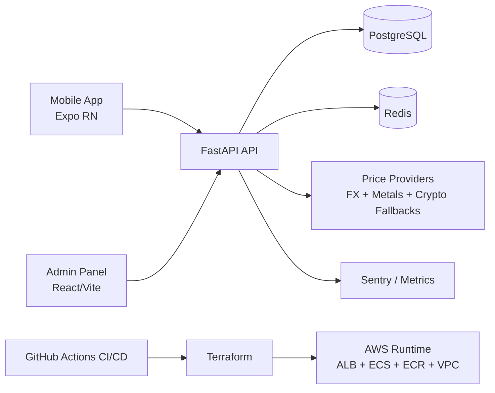

# MarketPulse AI

**Product-grade investment intelligence platform** built as a full-stack monorepo: mobile app, admin ops panel, resilient pricing pipeline, and production-minded backend.


---

## Quick Navigation

- [Why This Repo Stands Out](#why-this-repo-stands-out)
- [Live Product Gallery](#live-product-gallery)
- [Top Engineering Wins](#top-engineering-wins)
- [System Overview](#system-overview)
- [60-Second Local Boot](#60-second-local-boot)
- [Production Signals](#production-signals)
- [ADR Highlights](#adr-highlights)
- [Recruiter / Hiring Snapshot](#recruiter--hiring-snapshot)

---

## Why This Repo Stands Out

- **End-to-end ownership:** `apps/mobile` + `apps/admin` + `apps/api` + infra + CI/CD in one coherent system.
- **Real engineering depth:** JWT hardening, refresh token rotation, CSRF for cookie auth, rate limiting, step-up auth, incident automation.
- **Product thinking inside code:** insights, goals, strategy coach, what-if simulation, retention-oriented flows, analytics hooks.
- **Operational maturity:** release gates, rollback automation hooks, smoke checks, observability, runbook, ADR discipline.
- **Portfolio signal quality:** multi-provider price aggregation with fallback chain and reliability-oriented failover behavior.

---

## Live Product Gallery

> Add your screenshots/GIFs under `assets/` and keep this section as your public showcase.

- `assets/mobile-dashboard.png` - portfolio summary, risk, and insight feed
- `assets/mobile-strategy-hub.png` - coach loop + what-if simulator
- `assets/admin-operations.png` - incident center and operational controls
- `assets/admin-assets.png` - asset lifecycle and provider/source visibility
- `assets/demo-flow.gif` - end-to-end walkthrough (login -> insight -> action -> outcome)

---

## Top Engineering Wins

- **Resilient market data pipeline**
  - Multi-provider fallback for forex/metals/crypto with source labeling and degraded-mode survivability.
- **Security-first session architecture**
  - Cookie auth + CSRF checks + refresh token rotation + role/step-up controls for critical paths.
- **Production-style release gates**
  - CI security scans, readiness/perf checks, release note discipline, rollback automation hooks.
- **Observability + incident readiness**
  - Health/readiness detail paths, incident signals, runbook-driven operations and response scripts.
- **Cross-platform product execution**
  - Mobile investor UX + admin operations UX + backend contracts in one monorepo with shared types.

---

## Monorepo Structure

- `apps/mobile` - Expo/React Native app (investor-facing experience)
- `apps/admin` - React + Vite admin panel (operations and controls)
- `apps/api` - FastAPI backend (auth, portfolio, strategy, billing, observability)
- `packages/ui` - shared UI primitives/tokens
- `packages/types` - shared types/contracts
- `infra` - Docker stack, scripts, Terraform modules/environments
- `tests` - e2e/perf suites (`Playwright`, `k6`)

---

## System Overview



---

## 60-Second Local Boot

### One command (recommended)

```bash
npm run setup:local
```

This script will:
- install dependencies
- bootstrap `infra/.env` if missing
- start `postgres + redis + api + worker + admin`
- run Alembic migrations
- seed demo data
- generate OpenAPI client types

### Local endpoints

- Admin: `http://localhost:5173`
- API docs: `http://localhost:8000/docs`
- Readiness: `http://localhost:8000/api/v1/health/readiness`

### Demo credentials

- `admin@marketpulse.ai / Admin123!`
- `demo@marketpulse.ai / Demo12345!`

---

## Developer Commands

```bash
# monorepo
npm run dev
npm run build

# local bootstrap and live demo
npm run setup:local
npm run demo:live

# tests
python3 -m pytest -q                       # from apps/api
npm run test --workspace=apps/admin
npm run test --workspace=apps/mobile -- --runInBand
npm run test:e2e
npm run test:perf:k6
```

---

## Production Signals

- **Security gates:** gitleaks, semgrep, pip-audit, npm audit in CI.
- **Quality gates:** backend tests + coverage threshold, admin/mobile tests, e2e, perf smoke.
- **Deploy discipline:** staged deploy flow, release gate check, rollback script path.
- **Infra as code:** Terraform modules and environment overlays.
- **Runbook-driven ops:** incident playbook, smoke checks, release verification checklist.

---

## Security Highlights

- Cookie-based auth + CSRF enforcement
- Refresh token hashing and rotation
- Redis-backed rate limiting for auth and websocket paths
- Admin role protection + critical action step-up controls
- Security incident automation scripts and runbook guidance

See:
- `docs/SECURITY_CHECKLIST.md`
- `docs/security/SECURITY_BASELINE.md`
- `docs/security/AUTOMATED_CHECKS_MATRIX.md`

---

## Infrastructure Highlights

- Containerized local stack with `docker compose`
- Terraform-managed production foundation (networking, ALB, ECS, ECR, observability primitives)
- CI-integrated validation and deployment gates

See:
- `docs/DEPLOYMENT_README.md`
- `docs/PRODUCTION_ENVIRONMENT_GUIDE.md`
- `docs/RUNBOOK.md`

---

## Engineering Documentation

- ADR index: `docs/adr/README.md`
- Test strategy: `docs/TEST_STRATEGY.md`
- Case study: `docs/CASE_STUDY_MARKETPULSE.md`
- Priority roadmap: `docs/PRIORITY_ACTION_PLAN.md`
- Release discipline: `docs/releases/README.md`

---

## ADR Highlights

- `docs/adr/0001-api-worker-ayrimi.md` - API and worker separation rationale
- `docs/adr/0002-refresh-token-rotation.md` - strict refresh rotation trade-offs
- `docs/adr/0003-realtime-mimari-tercihi.md` - realtime architecture decisions

---

## Recruiter / Hiring Snapshot

If you are evaluating engineering maturity, this repo demonstrates:
- full-stack product development across mobile + backend + admin
- security-first backend patterns in a fintech-like domain
- production readiness habits (CI gates, rollback thinking, runbook)
- measurable product/ops mindset (analytics, release criteria, incident flow)

This is not a toy CRUD demo; it is a **system-level portfolio project** with real operational depth.

---

## Contribution

PRs are welcome. Please keep release notes and test quality gates aligned with existing project standards.
